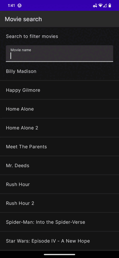

[](https://www.figma.com/file/iJbFMd9ZzU2U9iQZ0nk72t/Fractal-Foundations)&nbsp;
[](https://github.com/petedoyle/compose-exploration/actions/workflows/ci.yml)&nbsp;

# About
A place for ✨👨‍🔬 personal exploration 👩‍🔬✨ of best practices for Compose, design systems, testing, modularization, linting & enforcement of best practices, Gradle config, build speeds, CI, etc.


## Repo structure
This is a Gradle monorepo containing multiple apps (see [apps/](apps)) and common modules shared between them (see [common/](common/)), mainly to allow me to amortize the cost of project setup, in a way that I can easily maintain (Gradle, design system, test infra, CI, etc.)

To view in Android Studio, open the root `build.gradle` file. Then, choose the app you want to run and hit play.

## Apps
| App  |                                                                                            |
|:-----|--------------------------------------------------------------------------------------------|
| <br>**Compose Commerce**<br><br> An online shopping app that integrates with the [BigCommerce](https://www.bigcommerce.com) API. <br><br> **[> Browse](apps/compose-commerce/)**<br><br> | </img> |
| <br>**Compose Search**<br><br>A simple single-screen app that allows you to search / filter a list of items. A small sample showing Unidirectional Data Flow (UDF) via MVI, including tests.<br><br>**[> Browse](apps/compose-search)** <br><br> | </img>     |

## Modules
This is a Gradle monorepo, with many modules:


## License
```
Copyright (C) 2022 Pete Doyle

Licensed under the Apache License, Version 2.0 (the "License");
you may not use this file except in compliance with the License.
You may obtain a copy of the License at

   http://www.apache.org/licenses/LICENSE-2.0

Unless required by applicable law or agreed to in writing, software
distributed under the License is distributed on an "AS IS" BASIS,
WITHOUT WARRANTIES OR CONDITIONS OF ANY KIND, either express or implied.
See the License for the specific language governing permissions and
limitations under the License.
```
